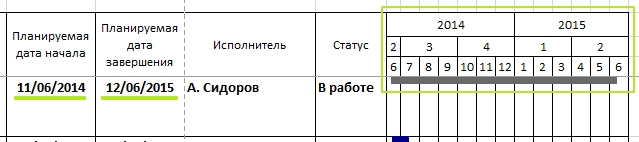

# Кнопка Выбор листа >> Отмена

### Подготовка

**Инструменты:**

- Microsoft Excel

- [Таблица Ганта](https://disk.yandex.ru/d/IXRviK5MR12Kuw)

**Предусловие:**

1. Открыта **Таблица Ганта**

2. Дано **Разрешение на редактирование**, если Microsoft Excel затребует 

3. Нажата кнопка **Включить содержимое** на всплывающем окне, в верхней части открытого файла

4. Создан новый лист, на него скопированы строки с 1 по 5 из листа Структура. Внесены изменения в скопированные данные, что-бы было видно, что данные взяты с нового листа, исключены изменения заголовков таблицы.

### Шаги

1. В шапке Excel перейти во вкладку **Гант**

2. Нажать кнопку **Выбор листа**
   
   > О.Р: открылось диалоговое окно Выбор листа структуры

3. В ранее созданном листе выбрать диапазон скопированных значений и нажать кнопку **Отмена**

4. Нажать кнопку **Построить**

### Ожидаемый результат

Таблица на листе **Гант диаг** сформировалась в соответствии с данными написанными на листе **Штампы**, за исключением:

- На каждой странице слева (формируется только при печати);
- На каждой странице по центру (формируется только при печати).

Также данными с листа **Структура**:

- № п/п;

- Номер в структуре;

- Название задачи;

- Планируемая дата начала;

- Планируемая дата завершения;

- Исполнитель;

- Статус;

- Диаграмма с делением на Год, Квартал, Месяц (построение от Планируемой даты начала до Планируемой дата завершения):

