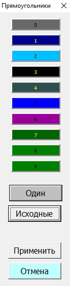

# Кнопка Прямоуг Исходные

### Подготовка

**Инструменты:**

- Microsoft Excel

- [Таблица Ганта](https://disk.yandex.ru/d/IXRviK5MR12Kuw)

**Предусловие:**

1. Открыта **Таблица Ганта**

2. Дано **Разрешение на редактирование**, если Microsoft Excel затребует 

3. Нажата кнопка **Включить содержимое** на всплывающем окне, в верхней части открытого файла

4. Изменён лист **Структура**:
   
   - первым 10 строкам в столбце **Уровень** заданы значения от 0 до 9;
   
   - остальные строки удалены. 

5. Построена таблица Ганта **(Вкладка Гант >> Кнопка Построить)**

6. Изменены цвета диаграммы по кейсам [Кнопка_Прямоуг_Один_Применить](Кнопка_Прямоуг_Один_Применить.md) или [Кнопка_Прямоуг_Тонкая_настройка_Применить](Кнопка_Прямоуг_Тонкая_настройка_Применить.md)

### Шаги

1. Перейти во вкладку **Гант**

2. Во вкладке **Гант** нажать кнопку **Прямоуг**

3. В открывшемся окне **Прямоугольники** нажать кнопку **Исходные**
   
   > О.Р.: цветак кнопок от 0 до 9 изменились в соответствии скриншоту: 
   > 
   > 

4. Нажать кнопку **Отмена** 
   
   > О.Р.: цвет диаграммы не изменились и остались прежними в соответствии с настройками произведёнными ранее

5. Нажать кнопку **Сохранить**

6. Закрыть таблицу

7. Открыть таблицу заново

8. Перейти во вкладку **Гант**

9. Во вкладке **Гант** нажать кнопку **Прямоуг**

10. В открывшемся окне **Прямоугольники** нажать кнопку **Исходные**
    
    > О.Р.: цветак кнопок от 0 до 9 изменились в соответствии скриншоту: 
    > 
    >  

11. Нажать кнопку **Применить**
    
    > О.Р.: таблица отрисовалась заново и цвет диаграммы изменился в соответствии с выбранными.

### Ожидаемый результат

Промежуточные ожидаемые результаты соответствуют фактическому.
