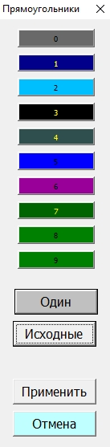

# Кнопка Прямоуг Один >> Отмена

### Подготовка

**Инструменты:**

- Microsoft Excel

- [Таблица Ганта](https://disk.yandex.ru/d/IXRviK5MR12Kuw)

**Предусловие:**

1. Открыта **Таблица Ганта**

2. Дано **Разрешение на редактирование**, если Microsoft Excel затребует 

3. Нажата кнопка **Включить содержимое** на всплывающем окне, в верхней части открытого файла

4. Изменён лист **Структура**:
   
   - первым 10 строкам в столбце **Уровень** заданы значения от 0 до 9;
   
   - остальные строки удалены. 

5. Построена таблица Ганта **(Вкладка Гант >> Кнопка Построить)**

### Шаги

1. Перейти во вкладку **Гант**

2. Во вкладке **Гант** нажать кнопку **Прямоуг**
   
   > О.Р.: открылось окно **Прямоугольники** 
   > 
   > 

3. Нажать кнопку **Один**
   
   > О.Р.: открылось окно **Цвета**

4. Выбрать цвет и нажать кнопку **Ок**
   
   > О.Р.: кнопки от 0 до 9 изменили цвет в соответствии выбранному

5. Нажать кнопку **Отмена**

### Ожидаемый результат

Цвет диаграммы не изменились и остались прежними.
