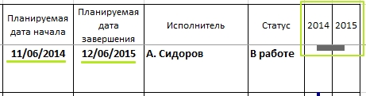
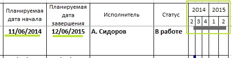

# Кнопки раздела Масштаб

### Подготовка

**Инструменты:**

- Microsoft Excel

- [Таблица Ганта](https://disk.yandex.ru/d/IXRviK5MR12Kuw)

**Предусловие:**

1. Открыта **Таблица Ганта**

2. Дано **Разрешение на редактирование**, если Microsoft Excel затребует 

3. Нажата кнопка **Включить содержимое** на всплывающем окне, в верхней части открытого файла

4. Построена таблица Ганта **(Вкладка Гант >> Кнопка Построить)**

### Шаги

1. Во вкладке **Гант** нажать кнопку **Год**
   
   > О.Р.: таблица отрисовалась заново, деления диаграммы соответствуют выбранной настройки **Год** 
   > 
   > 

2. Во вкладке **Гант** нажать кнопку **Квартал**
   
   > О.Р.: таблица отрисовалась заново, деления диаграммы соответствуют выбранной настройки **Квартал** 
   > 
   > 

3. Во вкладке **Гант** нажать кнопку **Месяц**
   
   > О.Р.: таблица отрисовалась заново, деления диаграммы соответствуют выбранной настройки **Месяц** 
   > 
   > 

### Ожидаемый результат

Промежуточные ожидаемые результаты соответствуют фактическому.
