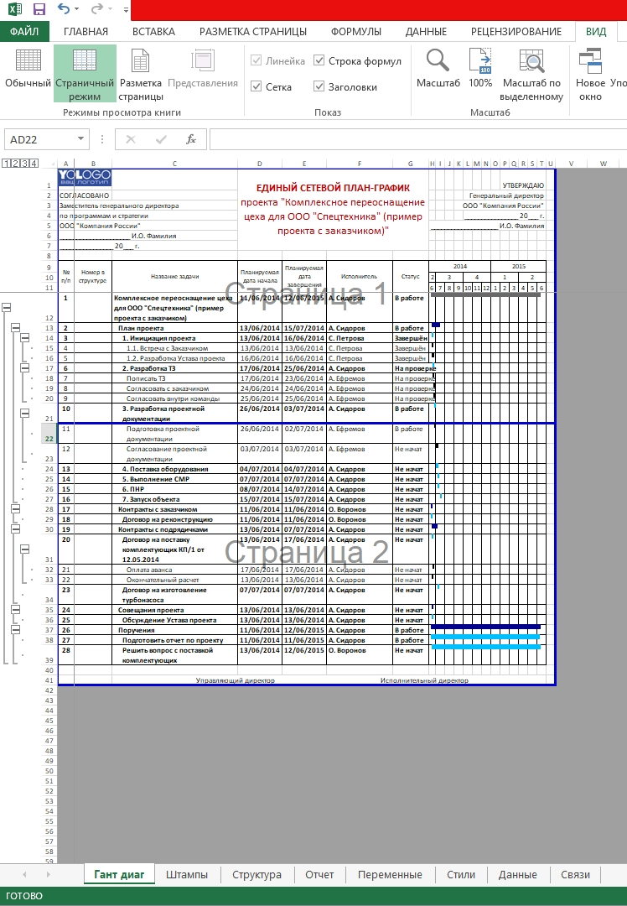

# Формирование штампа таблицы Ганта

### Подготовка

**Инструменты:**

- Microsoft Excel

- [Таблица Ганта](https://disk.yandex.ru/d/IXRviK5MR12Kuw)

**Предусловие:**

1. Открыта **Таблица Ганта**

2. Дано **Разрешение на редактирование**, если Microsoft Excel затребует 

3. Нажата кнопка **Включить содержимое** на всплывающем окне, в верхней части открытого файла

4.  Построена таблица Ганта (Вкладка Гант >> Кнопка Построить) 

5. Выровнена страничная граница на 2 страницы  по вертикали (Вкладка Вид > Страничный режим)
   
   

### Шаги

1. Перейти в раздел **Файл**

2. Нажать кнопку **Печать**

### Ожидаемый результат

Документ сформировался в соответствии с данными написанными на листе **Штампы**.
